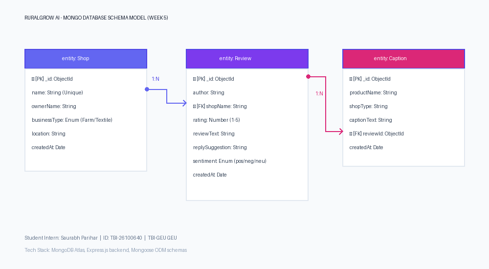

# RuralGrow AI

A review reply helper and social media caption generator built to assist local growers, weavers, and homestay hosts in managing their online presence.

## Project Structure
* `frontend/`: React + Vite client application
* `backend/`: Node.js + Express.js REST API server
* `backend/models/`: Database schemas for Mongoose (Shop, Review, Caption)
* `SchemaDiagram.png` & `SchemaDiagram.pdf`: Database Schema ERD Diagram
* `CRUDVerification.pdf`: PDF compilation of CRUD testing screenshots
* `APICollection.json`: Saved Postman API request test suite

---

## Database Choice & Architecture

The application utilizes **MongoDB** as its persistent database solution:
- **Flexible Document Model**: Reviews and Instagram caption outputs are unstructured document types. MongoDB's BSON structure maps directly to Javascript objects without complex joins.
- **Scalability**: Perfect for logging fast-growing customer reviews across different merchant category profiles.
- **ODM Integration**: Managed using Mongoose ODM, utilizing distinct schema models for validation.

### Database Schema Design
Our database model contains three primary entities:
1. **Shop**: Stores merchant profiles (Farms, Weaving Centers, Homestays).
2. **Review**: Stores client review feedback and AI suggested reply templates (Linked in a 1:N relationship with Shop).
3. **Caption**: Stores generated Instagram promotion drafts.



---

## Local Setup & Installation

### 1. Database Setup (MongoDB Atlas)
1. Go to [MongoDB Atlas](https://www.mongodb.com/cloud/atlas) and create a free tier cluster (M0).
2. Whitelist your local network IP and create a database user with read/write permissions.
3. Retrieve your MongoDB connection string (e.g., `mongodb+srv://<username>:<password>@cluster.mongodb.net/ruralgrow`).
4. Paste this connection string inside your backend `.env` file as `MONGODB_URI`.

### 2. Backend Server Setup
1. Navigate into the backend directory:
   ```bash
   cd backend
   ```
2. Install the required Node packages:
   ```bash
   npm install
   ```
3. Create a `.env` configuration file in the backend root based on `.env.example`:
   ```bash
   PORT=5000
   MONGODB_URI=mongodb+srv://<username>:<password>@cluster.mongodb.net/ruralgrow
   ```
   *Note: If no MONGODB_URI is provided, the API automatically falls back to reading/writing JSON records from the local `backend/data/database.json` file, allowing you to test without a running MongoDB database.*
4. Start the backend in development hot-reload mode:
   ```bash
   npm run dev
   ```
   *The REST API will listen on port `5000`.*

### 3. Frontend Client Setup
1. Navigate into the frontend directory:
   ```bash
   cd ../frontend
   ```
2. Install client dependencies:
   ```bash
   npm install
   ```
3. Start the Vite React development server:
   ```bash
   npm run dev
   ```
   *The client interface will load at `http://localhost:5173`.*

---

## REST API Endpoint Details
The backend implements 8 main endpoints:
* **Reviews CRUD**:
  - `GET /api/reviews` — Fetch review list (supports filtering by `?sentiment=positive|negative|neutral` and searching by `?search=basmati`)
  - `GET /api/reviews/:id` — Fetch details of a single review log
  - `POST /api/reviews` — Log a new customer review (auto-assigns sentiment and reply suggestion templates)
  - `PUT /api/reviews/:id` — Update review text or rating values
  - `DELETE /api/reviews/:id` — Remove a review entry
  - `POST /api/reviews/:id/reply` — Manually trigger AI-drafted reply suggestion updates
* **Instagram Captions CRUD**:
  - `GET /api/captions` — Fetch saved social marketing posts history
  - `POST /api/captions` — Save a newly generated Instagram caption in the database
  - `DELETE /api/captions/:id` — Delete a saved caption draft from history

---

## Postman API Testing
To test endpoints, import the provided collection file into Postman or Thunder Client:
1. Load Postman and click **Import**.
2. Drag and drop the file `APICollection.json` or `W4_APICollection_TBI-26100640.json` from the project root.
3. Execute and verify the mock queries against your running local server!
